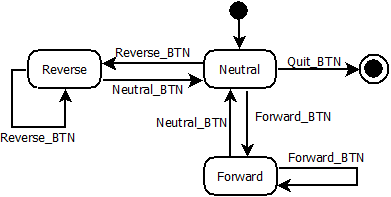

# c-EventDrivenStateMachine
A Event-Driven Finite State Machine written in C for Embedded Systems.
In the programming field, a event-driven state machine is charecterized if the transitions from one state to another is triggered by an event or a message.
This example is written in standard C language, where a car transmission system can be in one of the following states:
* Forward;
* Neutral;
* Reverse.
-

But, we can't go to Reverse gear directly from Forward and vice-versa; we need to pass thru Neutral before. Also, in this simple example, we can turn off the engine (i.e. quit the program) only at the Neutral state.

.
-

The events and states are associated in a bidimensional array like this example:
-

~~~
void (* State_Event_Matrix[EVENT][STATE]) () =
{
    {   // Event Neutral_btn click
        Not_Valid,      // callback function called when Neutral_btn clicked at NEUTRAL STATE
        Neutral,        // callback function called when Neutral_btn clicked at FORWARD STATE
        Neutral,        // callback function called when Neutral_btn clicked at REVERSE STATE
    },
    {   // Event Reverse_btn click
        Reverse,        // State NEUTRAL
        Not_Valid,      // State FORWARD
        Not_Valid,      // State REVERSE
    },
    {   // Event Forward_btn click
        Forward,        // State NEUTRAL
        Not_Valid,      // State FORWARD
        Not_Valid,      // State REVERSE
    },
    {   // Event Quit_btn click
        QuitProgram,        // State NEUTRAL
        Not_Valid,          // State FORWARD
        Not_Valid,          // State REVERSE
    }
};
~~~
The sequence of the events listed above should be in the same order as declared in the enum:
~~~
enum {
    NEUTRAL,
    FORWARD,
    REVERSE
}; // all the valid states

enum {
    NEUTRAL_BTN,
    REVERSE_BTN,
    FORWARD_BTN,
    QUIT_BTN
}; // all the possible events
~~~
